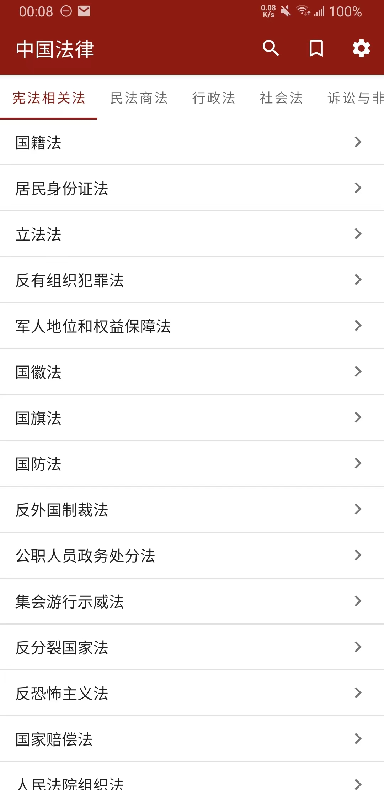
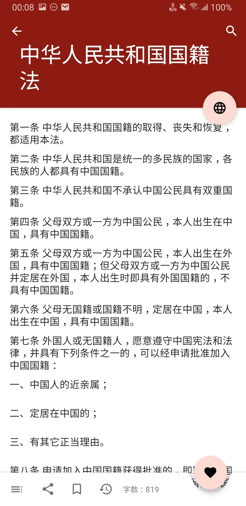
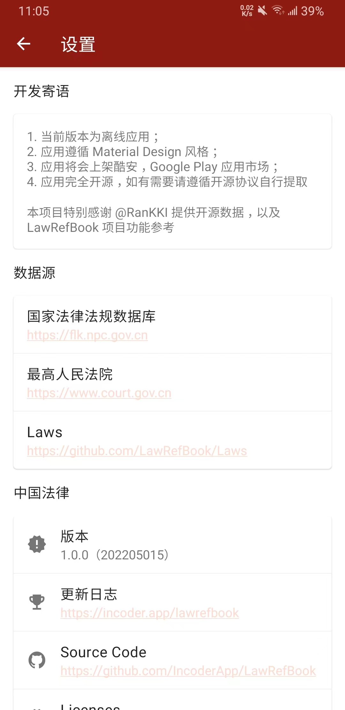
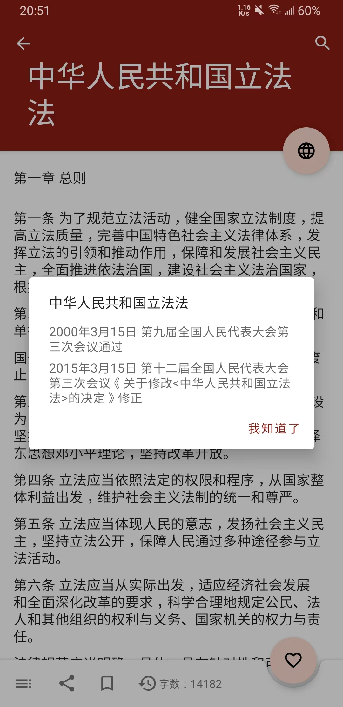
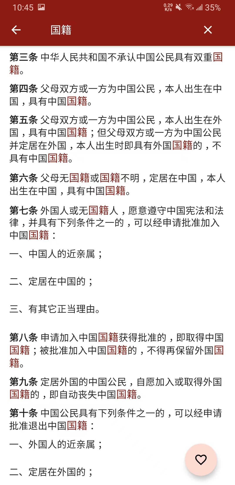

# SafetyProductionLaw

1. 当前版本为离线应用；
2. 应用遵循 Material Design 风格；
3. 应用未上架任何应用市场，仅供昌吉州安全生产执法监察支队内部使用；
4. 应用完全开源，如有需要请遵循开源协议自行提取

> 本项目特别感谢 [@Incode](https://github.com/Incoderapp) 提供开源数据。

## Preview

| 主页 | 内容页 | 个人页 |
|:-----------:|:-----------:|:-----------:|
||||
| 历史 | 目录 | 收藏 |
||||
| 搜索文章 | 搜索内容 | 等等 |
|||……|

